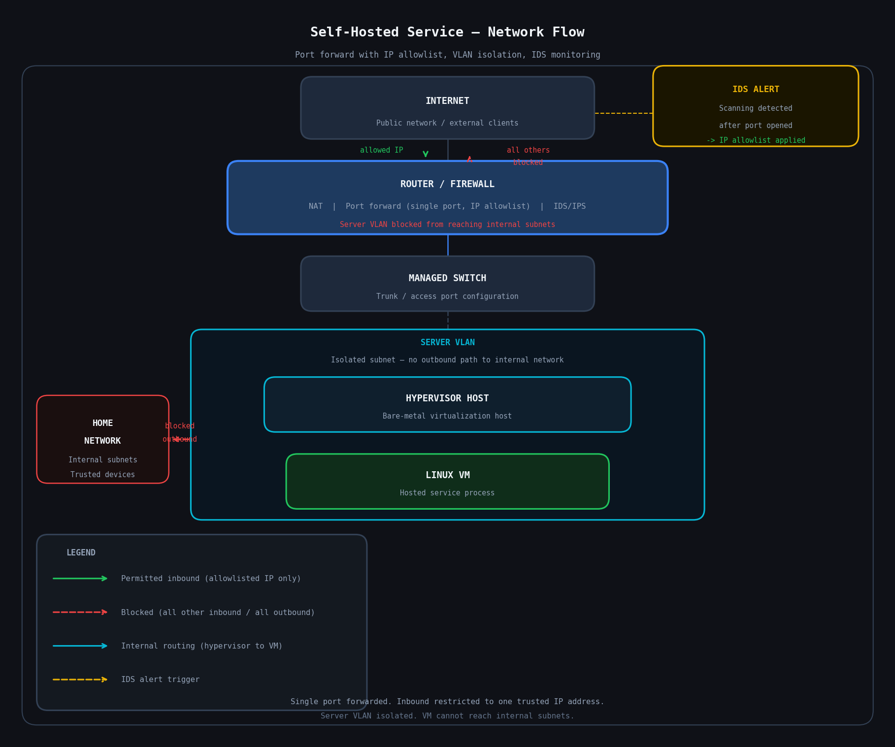

# Self-Hosted Service Deployment in a Segmented Homelab

Deploying a self-hosted service inside a virtualized, network-segmented environment with IP-based access control. This project covers the full deployment process including a real-world example of observing external threat activity and responding by tightening access controls.

**Skills demonstrated:** Virtualization, network segmentation, firewall policy, port forwarding, IP allowlisting, IDS monitoring, incident response, threat modeling, Linux administration

---

## Why I Did This

Hosting a service from home is a straightforward idea that gets complicated quickly once you think through the security implications. Exposing a port to the internet on a flat home network means that service sits on the same subnet as everything else. If something goes wrong, the blast radius is the entire network.

The approach here was to deploy the service inside a virtual machine on a dedicated server VLAN and forward only the specific port required. What started as an open port forward became a tighter, IP-restricted access control after observing real scanning activity against the exposed port shortly after it went live.

---

## Environment

| Component | Details |
|---|---|
| Hypervisor | Open-source bare-metal hypervisor |
| VM OS | Linux |
| Router / Firewall | Enterprise-grade managed router |
| Network | VLAN-segmented, service on dedicated subnet |
| IDS/IPS | Router built-in threat detection |

---

## VM Configuration

The service runs inside a Linux virtual machine with resources allocated through the hypervisor. The VM's network interface was assigned to the server VLAN at the hypervisor level, so it came up on the correct subnet automatically without additional network configuration inside the VM.

Using a VM rather than running the service directly on the host provides meaningful security and operational advantages:

- The host OS is not exposed even if the service software has a vulnerability
- Snapshots allow rollback if an update or config change breaks something
- The environment can be rebuilt quickly if needed
- The host remains unaffected by anything that happens inside the VM

---

## Network Design

The server VLAN is isolated from the rest of the home network. The only external traffic that reaches the VM is inbound on the single forwarded port, restricted to a permitted IP address. Everything else is dropped at the firewall.

```
Internet
   |
Managed Router (single port, IP allowlist enforced)
   |
Server VLAN
   |
Hypervisor Host
   |
Linux VM
   |
Hosted Service
```

The router handles NAT and the port forward rule. Firewall policy on the server VLAN blocks the VM from initiating connections to other internal subnets, so even if the VM were compromised, lateral movement to the rest of the network would be blocked.



---

## IDS Alerts and Access Control Response

When the port was initially opened, the router IDS began logging alerts from external IPs probing the forwarded port shortly after. None of it was targeted, just automated scanners continuously probing the public IPv4 space for open ports and vulnerable services. This is normal behavior on the internet and happens faster than most people expect.

Seeing those alerts was the prompt to take action. Rather than leaving the port accessible to any external IP, inbound access was restricted to a specific trusted IP address at the firewall level. After that change, the unsolicited scanning traffic was dropped before it could reach the VM.

This is a direct example of the monitor, detect, and respond cycle in practice. The IDS provided visibility, the alerts indicated unnecessary exposure, and the firewall rule was the corrective control.

---

## Security Design Rationale

**Confidentiality** is protected by placing the internet-facing VM on an isolated VLAN with no path to the rest of the home network. Personal data, other devices, and internal services are not reachable from the server subnet. IP allowlisting further limits who can reach the service at all.

**Integrity** is supported by containing the blast radius of a potential compromise. If the service were exploited, an attacker would land inside an isolated VM on an isolated VLAN with no outbound path to internal systems. The VM can be snapshotted and rebuilt without touching the host or any other part of the network.

**Availability** is addressed through virtualization. Running the service inside a VM rather than directly on the hypervisor host means the host remains available regardless of what happens to the VM. Snapshots allow rapid rollback if something breaks.

**Least privilege** is applied at both the network and firewall level. Only one port is forwarded. Only one IP address is permitted to use it. The VM has no outbound access to internal subnets. Every access control decision has a documented reason.

**Threat model:** The primary threats addressed are lateral movement from an internet-facing service, exploitation of the hosted software, and unauthorized access from untrusted external sources. VLAN isolation, default deny firewall policy, single port forwarding, and IP allowlisting work together to mitigate all of these. The decision to restrict access after observing IDS alerts is a concrete example of applying threat intelligence to improve a security posture in real time.

---

## Lessons Learned

- The internet will find your open port faster than you expect. Automated scanners are constant and indiscriminate. Assuming an obscure port stays unnoticed is not a security strategy.
- IDS alerts are only useful if you act on them. Seeing the scanning activity and responding by restricting access to a known IP turned a reactive observation into a proactive control.
- IP allowlisting on a port forward is a simple control that dramatically reduces exposure. If you know who needs access, there is no reason to leave a port open to the world.
- Network segmentation is not just a theory exercise. Knowing the VM sat on an isolated VLAN while scanning activity was hitting the port made the value of that isolation concrete.
- Virtualization adds a meaningful layer of isolation. Running an internet-facing service directly on a host with no containment is unnecessary risk.

---

## See Also

- [TROUBLESHOOTING.md](TROUBLESHOOTING.md) - Connectivity issues encountered during setup and how they were resolved
